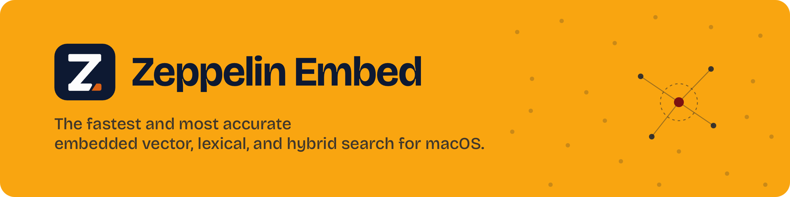
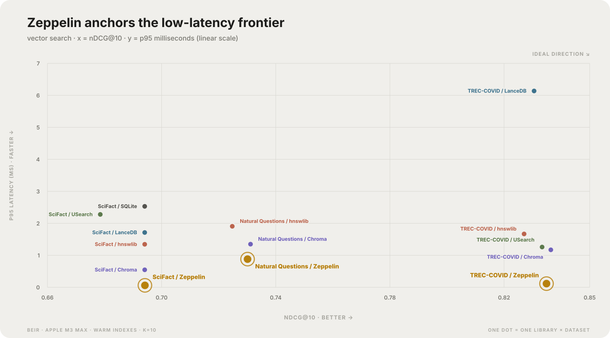

<div align="center">



[](https://github.com/zepdb/zeppelin-embed/actions/workflows/ci.yml)
[](https://github.com/zepdb/zeppelin-embed/actions/workflows/python.yml)
[](https://crates.io/crates/zeppelin-embed)
[](https://pypi.org/project/zeppelin-embed/)
[](https://www.npmjs.com/package/@zepdb/zeppelin-embed)
[](https://www.rust-lang.org)
[](LICENSE)

[Quick start](#quick-start) · [Search](#one-store-three-ways-to-search) · [APIs](#language-apis)

</div>

Zeppelin Embed is the fastest and most accurate in-process search engine built
for macOS and Apple silicon.

## Search performance



Vector graph-search p95 latency is plotted against nDCG@10. Lower latency and
higher nDCG@10 are better. Measured on an Apple M3 Max using warm indexes and
k=10. The SQLite TREC-COVID result (82.36 ms p95) is omitted to keep the
remaining results legible on a linear scale.

[BEIR](https://github.com/beir-cellar/beir) is a benchmark suite for evaluating
information retrieval across different domains.

- [SciFact](https://huggingface.co/datasets/BeIR/scifact) retrieves scientific
  evidence for factual claims.
- [TREC-COVID](https://huggingface.co/datasets/BeIR/trec-covid) retrieves
  biomedical literature for COVID-19 research questions.
- [Natural Questions](https://huggingface.co/datasets/BeIR/nq) retrieves
  Wikipedia evidence for real search-engine questions.

Compared with: [Chroma](https://github.com/chroma-core/chroma), [hnswlib](https://github.com/nmslib/hnswlib), [LanceDB](https://github.com/lancedb/lancedb), [sqlite-vec](https://github.com/asg017/sqlite-vec), and [USearch](https://github.com/unum-cloud/usearch).

## Why Zeppelin Embed

- **Vector, lexical, and hybrid retrieval.** Use one store and one document ID
  space for vector similarity, BM25, or fused results.
- **Local and persistent.** The engine runs inside your process, recovers from
  its write-ahead log, and publishes immutable searchable generations.
- **Fast native execution.** Runtime-dispatched SIMD kernels, quantized graph
  traversal, exact rescoring, memory-mapped segments, and bounded worker pools.
- **Production controls.** Typed filters, idempotent document revisions,
  cancellation, deadlines, retention, physical purge, memory budgets, health,
  and query diagnostics.
- **Bring your own vectors.** Use embeddings from any model that produces
  compatible document and query vectors.
- **One native engine, several languages.** Rust, a versioned C ABI, Python,
  Swift, Node.js, and TypeScript call the same storage and retrieval
  implementation.

## One store, three ways to search

| Mode | Input | Result |
|---|---|---|
| Vector | A precomputed `float32` query vector | Approximate graph retrieval by default, with exact and scan tiers available |
| Lexical | Raw query text or a structured lexical query | BM25 ranking with term, phrase, prefix, and phonetic operators |
| Hybrid | A query vector plus text | Vector and lexical candidates fused over one pinned store generation |

Vector and hybrid graph queries use quantized traversal to select candidates and
full-precision vectors to score the retained rows. Exact search remains
available when exhaustive membership is required. Every result reports the
generation it observed, and diagnostics report the path and work that actually
ran.

## Quick start

Install the Python package and run the five-vector example:

```bash
python -m pip install zeppelin-embed
python examples/python/five_vectors_search.py
```

The example supplies its own document and query vectors. Zeppelin Embed v0.1.0
does not bundle or download an embedding model.

The directory is the database. Reopen the same path to recover its committed
state and continue ingesting or searching.

For Rust, add the native core to an application:

```bash
cargo add zeppelin-embed
```

## Language APIs

| API | Distribution | Example |
|---|---|---|
| Python | PyPI wheel with the native library included | [`five_vectors_search.py`](examples/python/five_vectors_search.py) |
| Rust | [`zeppelin-embed`](crates/zeppelin-embed) on crates.io | [`five_vectors_search.rs`](crates/zeppelin-embed/examples/five_vectors_search.rs) |
| Swift | Swift Package Manager with a downloadable XCFramework | [`five_vectors_search.swift`](examples/swift/Sources/FiveVectorsSearch/five_vectors_search.swift) |
| C/C++ | GitHub release archive with the header and `.a`/`.dylib` libraries | [`five_vectors_search.c`](examples/c/five_vectors_search.c) |
| Node.js / TypeScript | [`@zepdb/zeppelin-embed`](https://www.npmjs.com/package/@zepdb/zeppelin-embed) with the native addon included | [`javascript.cjs`](node/examples/javascript.cjs) / [`typescript.ts`](node/examples/typescript.ts) |

The C ABI uses size-versioned requests and responses, typed error codes, and
matching free functions for every callee-owned result. Python wheels include
the native library. Swift consumes the same ABI through an actor-based
interface. Only the Rust core is published as a crate; the other packages
embed or link the C ABI.

The macOS SDK archive is language-neutral. Any runtime with C-compatible
foreign functions can use its header and static or dynamic library.

From a source checkout, run each example with:

```bash
# Python
cargo build --release -p zeppelin-embed-ffi
PYTHONPATH=python ZEPPELIN_EMBED_LIBRARY=target/release/libzeppelin_embed_ffi.dylib \
  python examples/python/five_vectors_search.py

# Rust
cargo run --release -p zeppelin-embed --example five_vectors_search

# Node.js
cd node
npm ci
npm run build:native
node examples/javascript.cjs
cd ..

# Swift
cargo build --release -p zeppelin-embed-ffi
ZE_USE_LOCAL_FFI=1 swift run --package-path examples/swift

# C
cargo build --release -p zeppelin-embed-ffi
cc -std=c11 examples/c/five_vectors_search.c \
  -I crates/zeppelin-embed-ffi/include -L target/release -lzeppelin_embed_ffi \
  -o /tmp/zeppelin-c-example
DYLD_LIBRARY_PATH=target/release /tmp/zeppelin-c-example /tmp/zeppelin-c-index
```

## Building from source

Zeppelin Embed uses stable Rust 1.93 or newer.

```bash
git clone https://github.com/zepdb/zeppelin-embed.git
cd zeppelin-embed
cargo test --workspace
```

Build the core C ABI library:

```bash
cargo build --release -p zeppelin-embed-ffi
```

Build a Python wheel:

```bash
python -m build --wheel python
```

## License

Zeppelin Embed is free software licensed under the
[GNU General Public License v3.0](LICENSE).
